# 혜택 알고 가즈아~!

 

## <프로젝트 요약>

> __프로젝트명 :__ 혜택 알고 가즈아~!
> 
> __플랫폼 :__ 안드로이드 기반 모바일 어플리케이션
> 
> __내용 :__ 사용자의 현재위치를 기반으로 근처 상점의 위치, 할인정보를 제공 App
> 
> __기간 :__ 2018.01 ~ 2018.10
> 
> __인원 :__ 4명
> 
> __역할 :__ 팀장 및 클라이언트(안드로이드) 개발
> 

 

## <목차>

### 1. [프로젝트 개요](#프로젝트-개요)
### 2. [프로젝트 설계](#프로젝트-설계)
### 3. [프로젝트 구현](#프로젝트-구현)
### 4. [프로젝트 라이브러리](#프로젝트-라이브러리)
### 5. [프로젝트 기술](#프로젝트-기술)
### 6. [기타](#기타)

 

## 프로젝트 개요

### <프로젝트 제안배경>

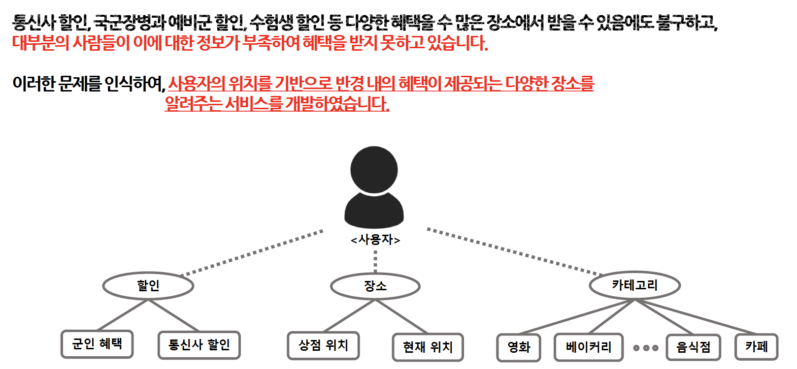

---

### <프로젝트 내용>

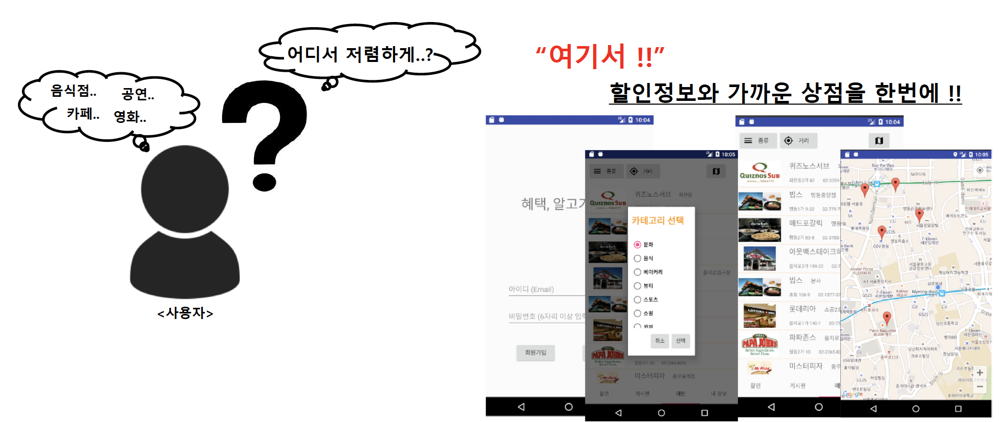

---

### <프로젝트 주요기술>

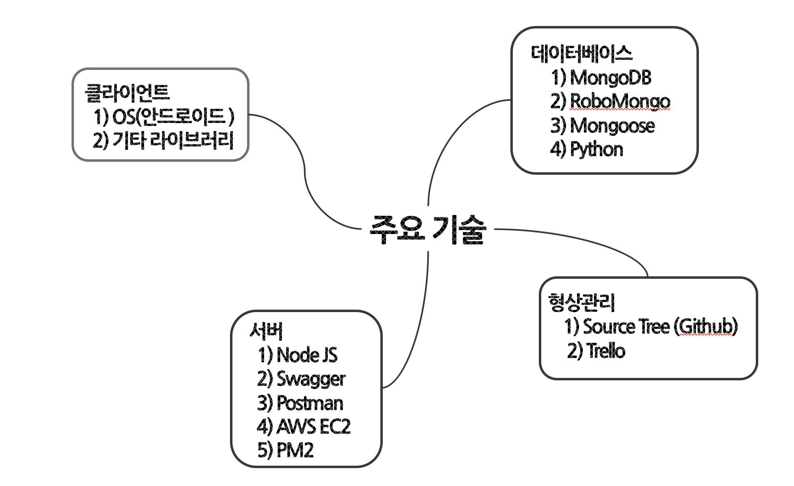

---

  

## 프로젝트 설계

### <안드로이드 OS>

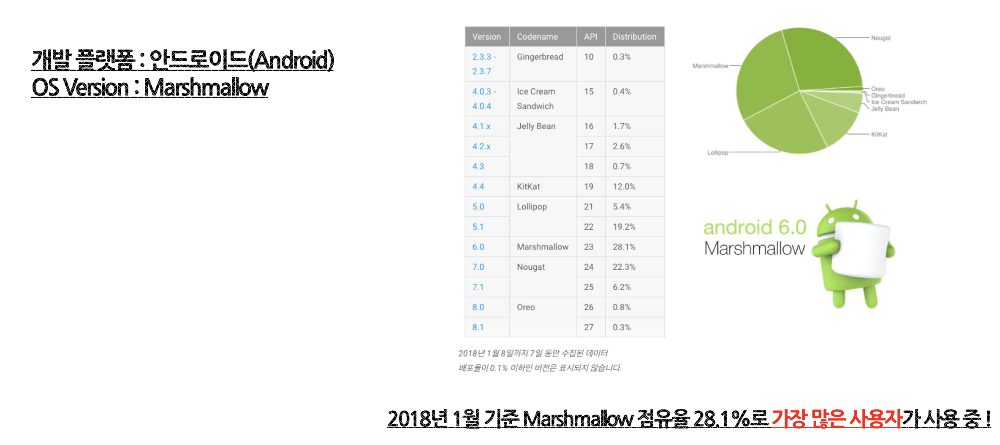

---

### <화면 구성>

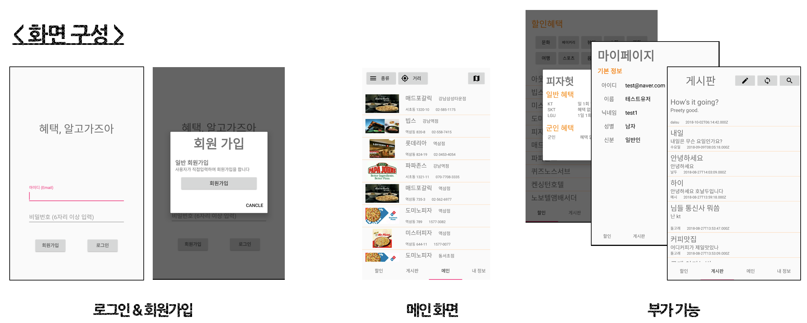

---

### <기능 구성>

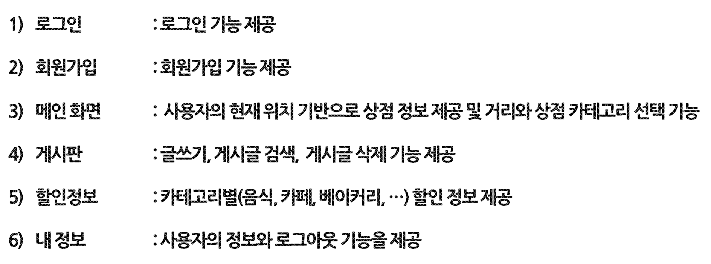

---

 

## 프로젝트 구현

### <로그인>

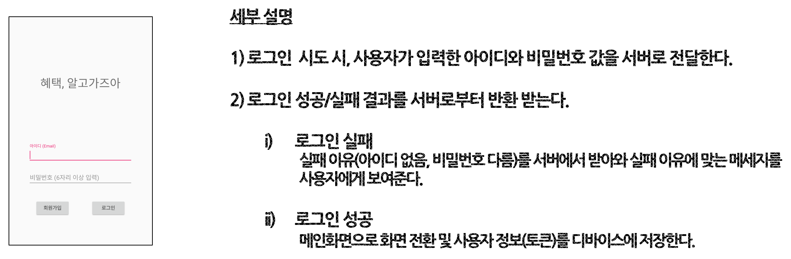

---

### <회원가입>

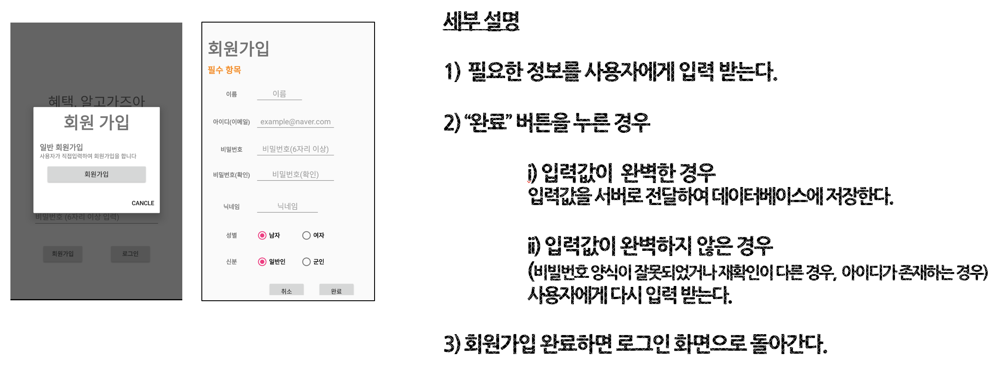

---

### <메인화면>

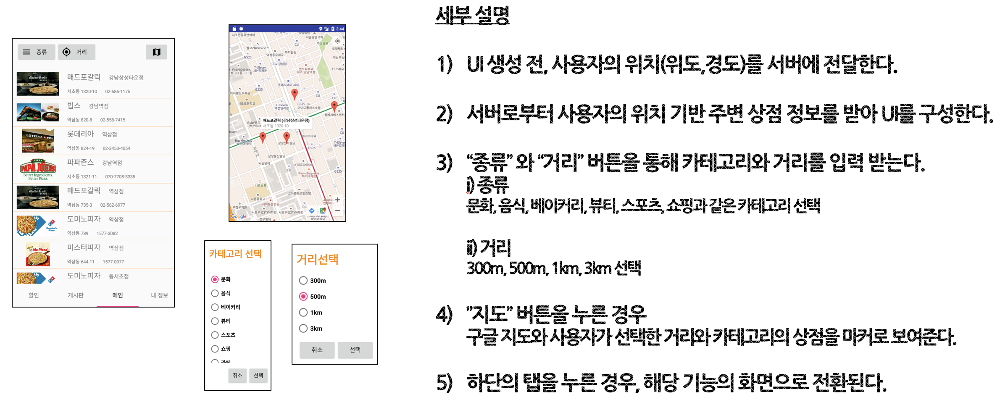

---

### <게시판>

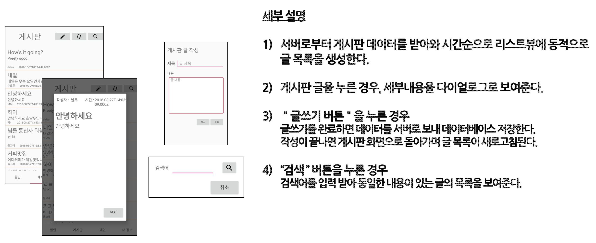

---

### <할인정보>

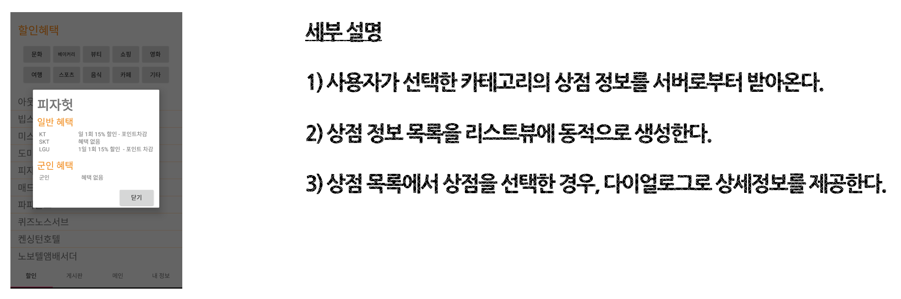

---

### <내 정보>

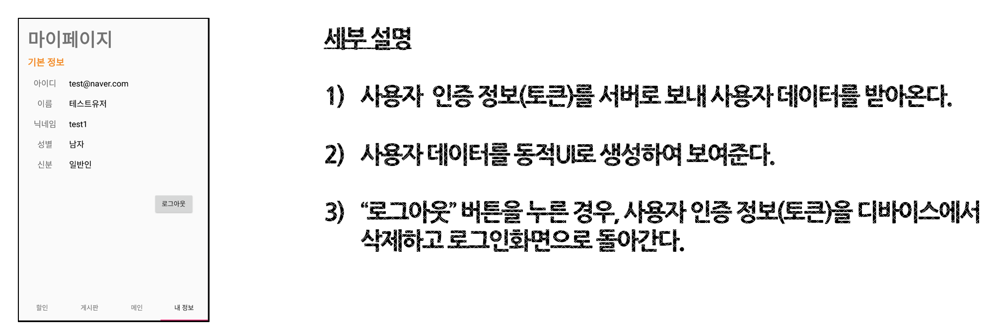

---

 

## 프로젝트 라이브러리

### <Shared Preference & JWT>

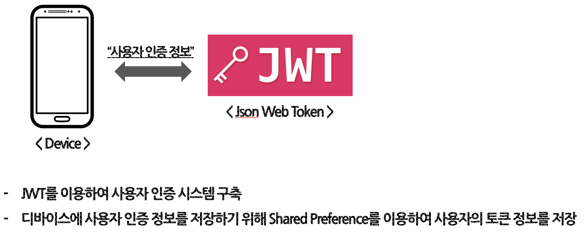

---

### < HostTab Layout >

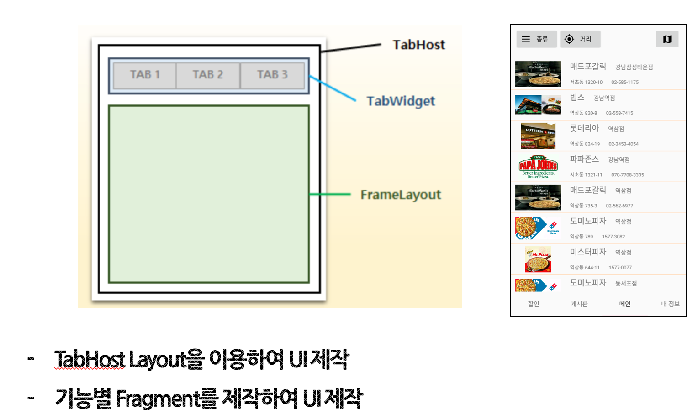

---

### < Google API >

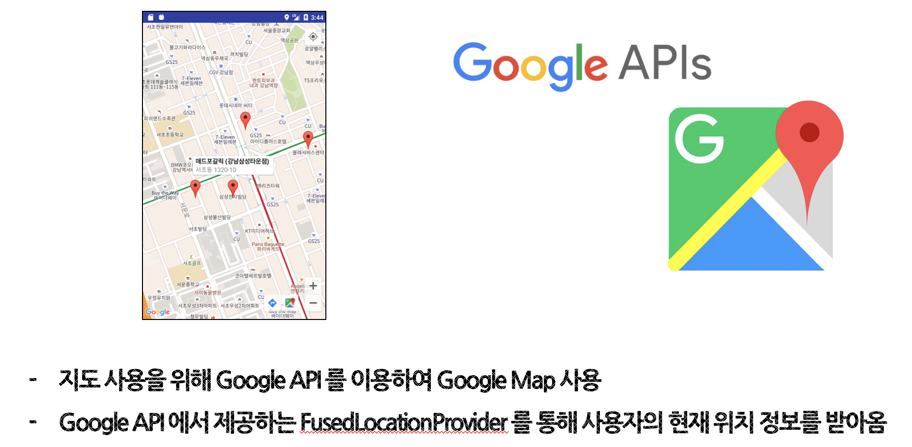

---

### < Retrofit >

---

### < Glide >

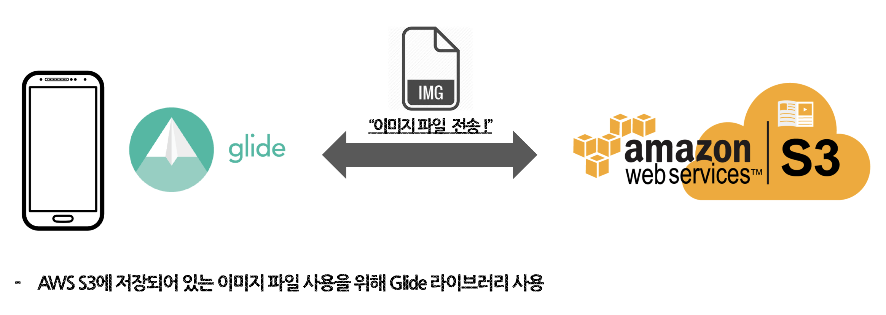

---

 

## 프로젝트 기술

### <서버>

> __플랫폼 : 노드JS(NodeJS)__
> 
> __개발툴 : Atom, Postman__
> 
> __기타 : AWS EC2, Swagger__
> ___AWS EC2를 사용하여 서버 및 데이터베이스 구축___
>
> ___Swagger를 이용하여 API문서를 제작하여 클라이언트 개발과 소통하여 개발을 진행___
>

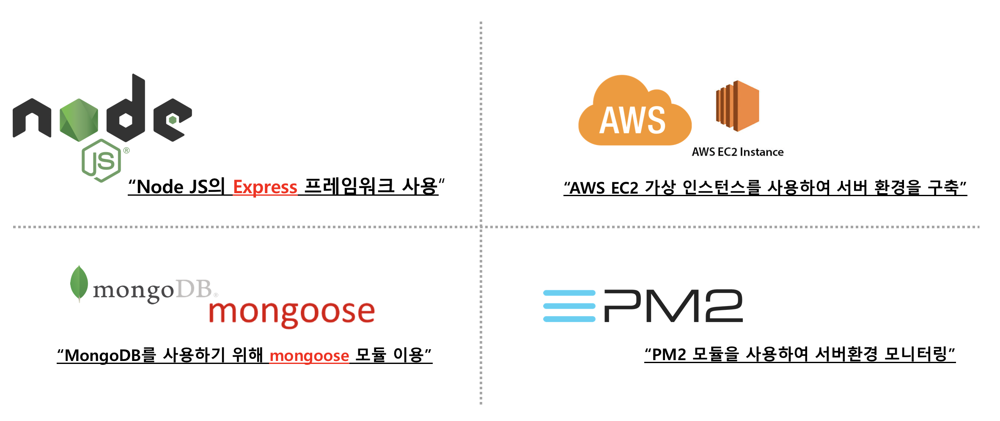

---

### <데이터 베이스>

> __플랫폼 : 몽고DB(MongoDB), 파이썬(Python)__
> 
> __개발툴 : Robo Mongo 3T__
>
> ___데이터베이스를 구축하기 위한 데이터를 모으거나 변환하는데 파이썬를 활용___
>
> ___데이터 구축을 위한 크롤링 코드 및 주소를 위도, 경도로 변환하는 작업을 파이썬으로 진행하여 데이터 베이스를 구축___
>

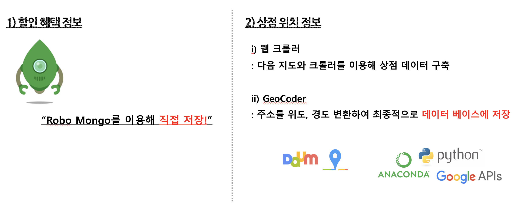

---

### <형상 관리>

> __형상관리 도구 : 소스트리(Source Tree), 깃허브(Github), 트렐로(Trello)__
> 
> ___소스코드 및 개발 협업은 소스트리를 통한 깃허브의 공동 [Organizations](https://github.com/Graduate-Project-SMU)을 제작하여 진행___
>
> ___아이디어 회의 및 회의록은 [트렐로](https://trello.com/b/vTy17bHl)를 이용하여 기록 및 진행___
>

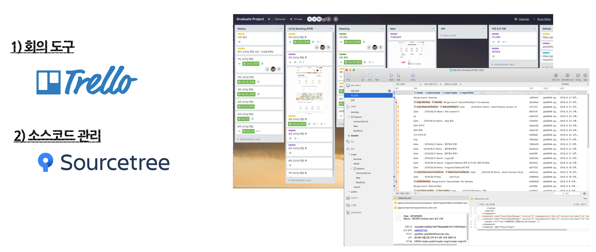

---

### <기술 스택>

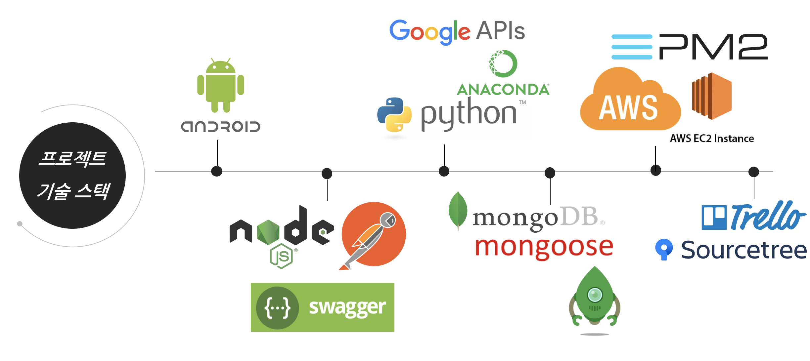

---

## 기타

__[서버 프로젝트](https://github.com/Graduate-Project-SMU/benefit_server)로 이동!__

__[트렐로](https://trello.com/b/vTy17bHl) 이동!__

__본 프로젝트 [Organizations](https://github.com/Graduate-Project-SMU)으로 이동!__
